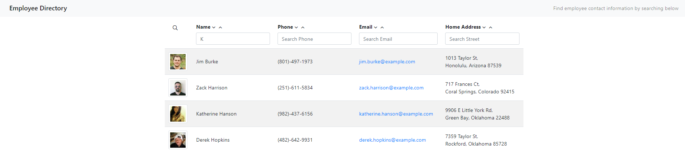

# Employee Directory

## Description

Application that will allow a user to view a companies employees and their contact information.  Should provide user with the ability to sort ascending/descending on each column values, or search within columns for values matching search terms.  App built using React.

Deployed Site: 

Site Repository: [https://github.com/Udunomancer/emp-directory](https://github.com/Udunomancer/emp-directory)

## Table of Contents
* [Installation](#installation)
* [Usage](#usage)
* [License](#license)
* [Contributing](#contributing)
* [Tests](#tests)
* [Questions](#questions)

##  Installation

* Fork from the GitHub Repository: [https://github.com/Udunomancer/emp-directory](https://github.com/Udunomancer/emp-directory)
* Ensure that node is available on device
* Install packages
* Follow steps to deploy site to GitHub pages

##  Usage

* User should be able to view the application by navigating to 
    * When the page loads, random employee data should load via API to populate page.
* When a user clicks on either up or down button next to a column header, the table should be sorted by the values in that column
    * Down arrow will sort from A/0 > Z/9
    * Up arrow will sort from Z/9 > A/0
* When a user clicks the magnifying glass icon, search fields will display
    * Entering a value into a columns search field should filter the employee directory table to only employees with matching values in that column
    * Entering search values into multiple columns will return only employees that have matching values in all columns
    * Removing characters from the search will broaden search results
* When the user clicks the magnifying glass a second time, the search fields will be removed and the search terms will be cleared

##  License

[The MIT License](https://opensource.org/licenses/MIT)

##  Contributing

No public contributions accepted in this repository at this time.

If issues are found, please contact me using email/GitHub profile found in the Questions section below.

##  Tests

To confirm functionality, deploy site and:
* Confirm that random user data is loaded from the API
* Random user data is displayed on the page
* Using the sort buttons sorts the table based on the column values in the correct order (ascending/descending)
* Clicking the magnifying glass:
    * Displays the search fields if hidden
    * Hides the search fields if displaying, and clears current searh terms

##  Questions

Have questions?
* View my GitHub Profile: [https://github.com/Udunomancer](https://github.com/Udunomancer)
* Email me at: [kyle717@gmail.com](mailto:kyle717@gmail.com)